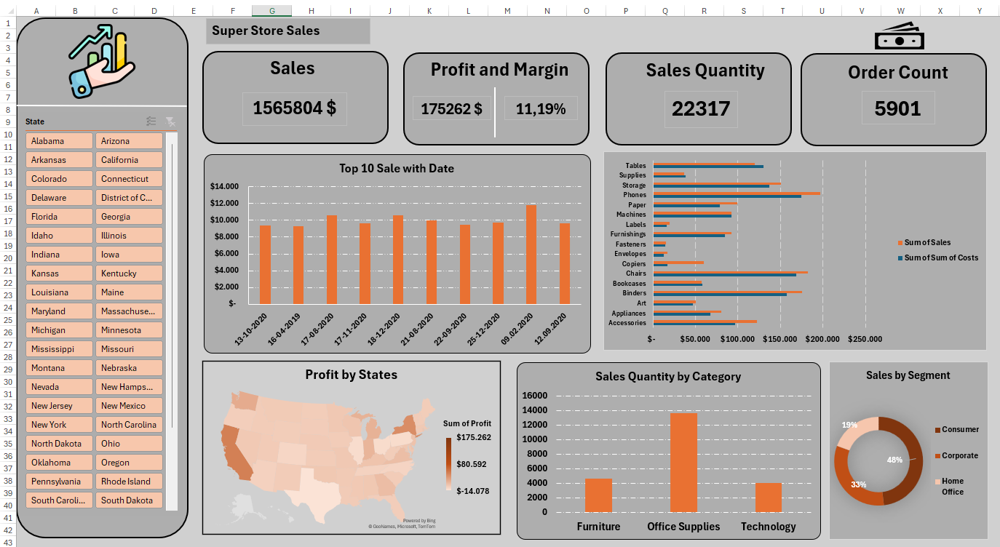

# Super-Store-Sales-Dashboard-Excel-
This project is an interactive Excel dashboard built using the Super Store Sales dataset to analyze sales performance and business insights.
## Features
- Sales and profit analysis
- Profit margin tracking
- Sales quantity and order count KPIs
- Top sales by date visualization
- Category and sub-category analysis
- State-wise profit analysis using map visualization
- Customer segment distribution analysis
- Interactive slicers and filters

## Tools & Technologies
- Microsoft Excel
- Pivot Tables
- Pivot Charts
- Slicers
- Dashboard Design

## Dashboard Preview

## Project Purpose
The purpose of this project is to demonstrate data analysis and dashboard development skills using Microsoft Excel by transforming raw sales data into meaningful business insights.
